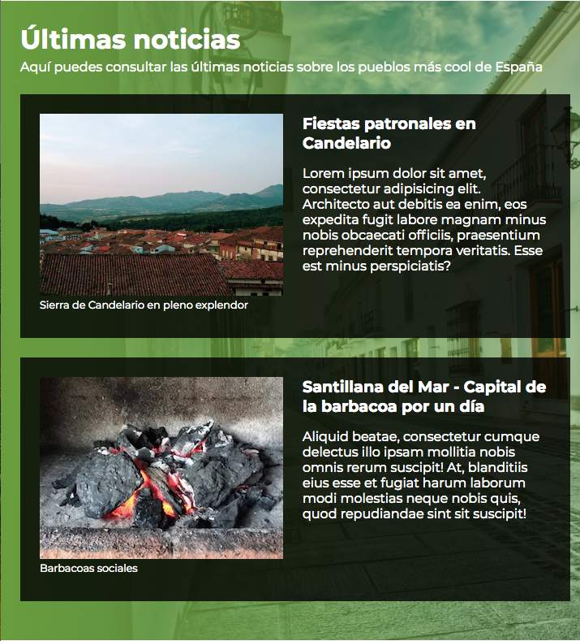

# Práctica de Pueblos Cool

Queremos realizar una web que simule el comportamiento (salvando las distancias) de la original.
Como esto es una práctica de semántica, queremos realizar las acciones necesarias para que demos 
sentido semántico a nuestros documentos. Ese es el objetivo. Nos olvidamos (aunque nos cueste), de 
responsive, de maquetaciones complejas, etc. Sólo nos importa el outline e ir calentando un poco.

## Qué ha de ir en el página

Esta práctica está dividida en varios pasos. 

### Paso1. Últimas noticias

El primero de ellos consiste en crear una sección de últimas noticias, donde encontraremos dos elementos que llamaremos leads.

Estos leads representan una pequeña introducción a la noticia completa e incluyen los siguientes elementos:

- Titular
- Imagen con su descripción 
- Texto introductorio

Este es el preview:

  