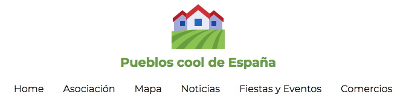
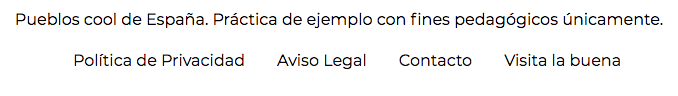

# Práctica de Pueblos Cool

Vamos ahora a crear una sencilla cabecera y un pie. Así le damos más sentido aún. 

### Paso 2. Header y Footer

Ahora vamos a crear una cabecera que contendrá:

- Logotipo con una leyenda: "Los pueblos más cool de España"
- Una barra de navegación con los siguientes enlaces:
    * Home
    * Asociación
    * Mapa
    * Noticias
    * Fiestas y Eventos
    * Comercios
    
Este es el preview:

  

- Un footer que contendrá:
    * Una leyenda con el texto: "Pueblos cool de España. Práctica de ejemplo con fines pedagógicos únicamente."
    * Una barra de navegación con los siguientes enlaces: 
      * Política de Privacidad
      * Aviso Legal
      * Contacto
      * Visita la buena: con enlace a "https://www.lospueblosmasbonitosdeespana.org"
      
