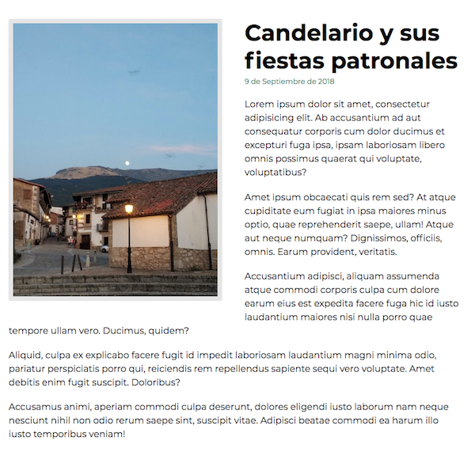

# Práctica de Pueblos Cool

Vamos ahora a crear una sencilla cabecera y un pie. Así le damos más sentido aún. 

### Paso 3. Artículo

Ahora vamos a crear un artículo:

- Se compone de una imagen que hace de apoyo del artículo
- Un encabezado con el titular de la noticia
- La fecha del mismo
- 5 párrafos
    
Este es el preview:

  

      
