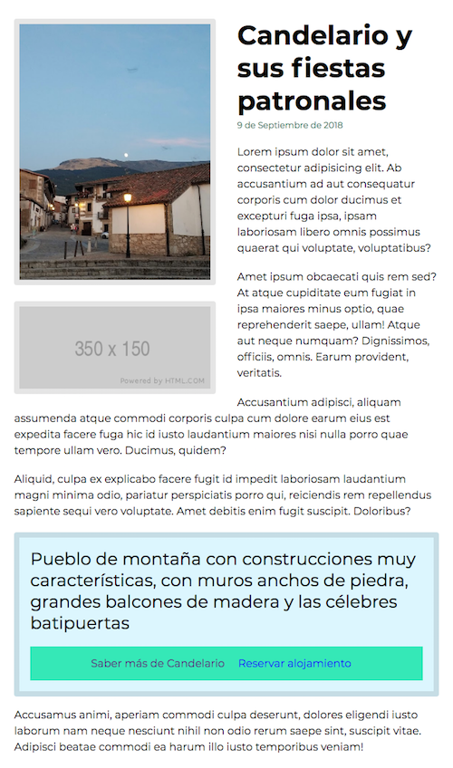

# Práctica de Pueblos Cool

Vamos a por el último paso 

### Paso 4. Publicidad y citas

Ahora tenemos un par de necesidades más para nuestro prototipo semántico. Son las siguientes:

- El artículo ha de llevar un slot de publicidad entre los dos primeros párrafos.
- El artículo ha de incorporar información extra que enriquezca el artículo:
    - Una cita de Candelario (de la wikipedia). 
    - Y dos enlaces:
        * Visitar la entrada de Wikipedia
        * Solicitar alojamiento 
    
Este es el preview:

  

      
